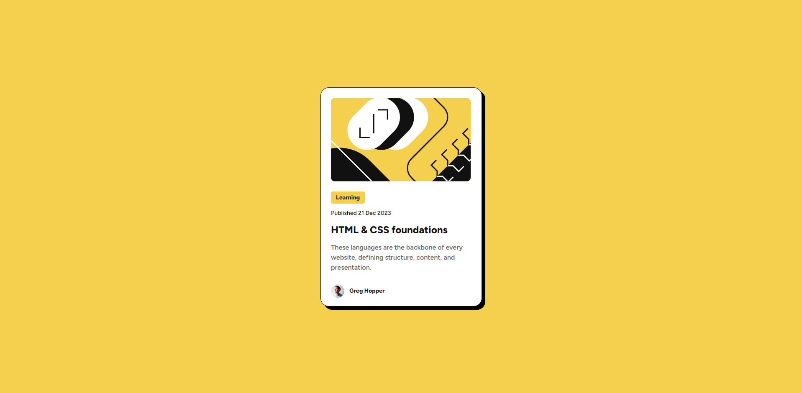

# Frontend Mentor - Blog preview card solution

This is a solution to the [Blog preview card challenge on Frontend Mentor](https://www.frontendmentor.io/challenges/blog-preview-card-ckPaj01IcS). Frontend Mentor challenges help you improve your coding skills by building realistic projects. 

## Table of contents

- [Overview](#overview)
  - [The challenge](#the-challenge)
  - [Screenshot](#screenshot)
  - [Links](#links)
- [My process](#my-process)
  - [Built with](#built-with)
  - [What I learned](#what-i-learned)
  - [Continued development](#continued-development)
  - [Useful resources](#useful-resources)
- [Author](#author)

## Overview

### The challenge

Users should be able to:

- See hover and focus states for all interactive elements on the page

### Screenshot

### Links

- Solution URL: [github.com/DAVstudy/blog-preview-card](https://github.com/DAVstudy/blog-preview-card)
- Live Site URL: [davstudy.github.io/blog-preview-card/](https://davstudy.github.io/blog-preview-card/)

## My process

### Built with

- HTML
- CSS

### What I learned

I learned more about CSS specifically 'grid' and 'flex', I used these elements to section and position the content. I also learned how to use Chrome's "inspect" tool to improve the styling of elements.

### Continued development

I will continue advancing to improve the structure of the styles and elements. Researching good practices.

### Useful resources

- [CSS Tutorial - W3schools](https://www.w3schools.com/css/default.asp) 
- [Learn to style HTML using CSS - MDN Web Docs](https://developer.mozilla.org/en-US/docs/Learn/CSS) 

## Author

- Website - [DevsDav](https://devsdav-web.vercel.app/)
- Frontend Mentor - [@DAVstudy](https://www.frontendmentor.io/profile/DAVstudy)
- X/Twitter - [@devsdav](https://x.com/DevsDav)
- Youtube - [DevsDav](https://www.youtube.com/@devsdav)
- Instagram - [@DevsDav](https://www.instagram.com/devsdav?utm_source=ig_web_button_share_sheet&igsh=ZDNlZDc0MzIxNw==)